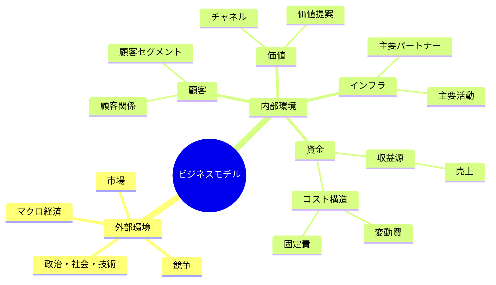
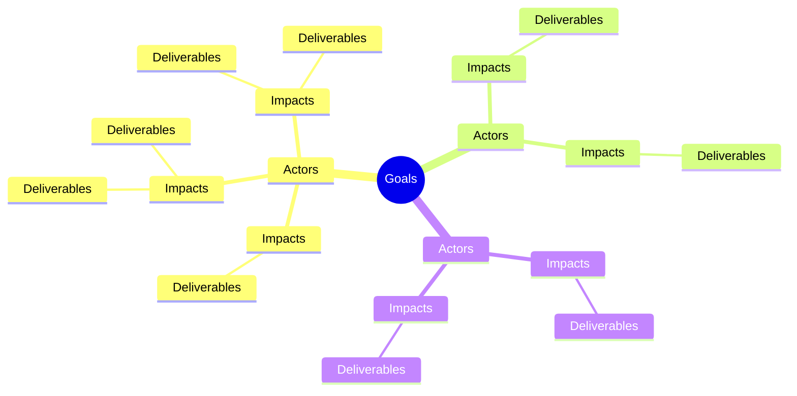
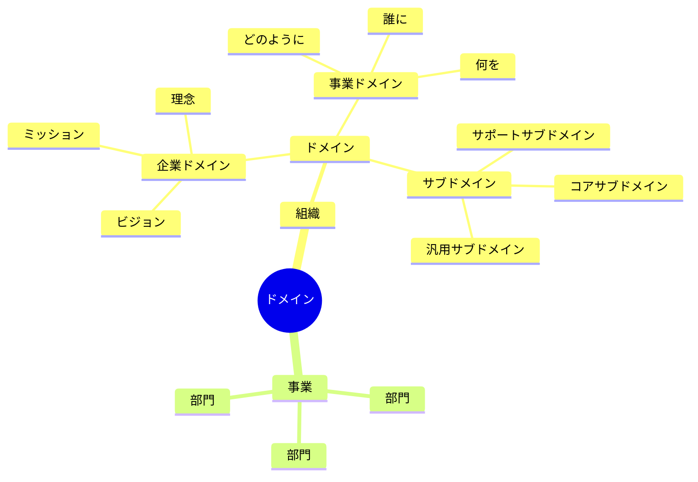
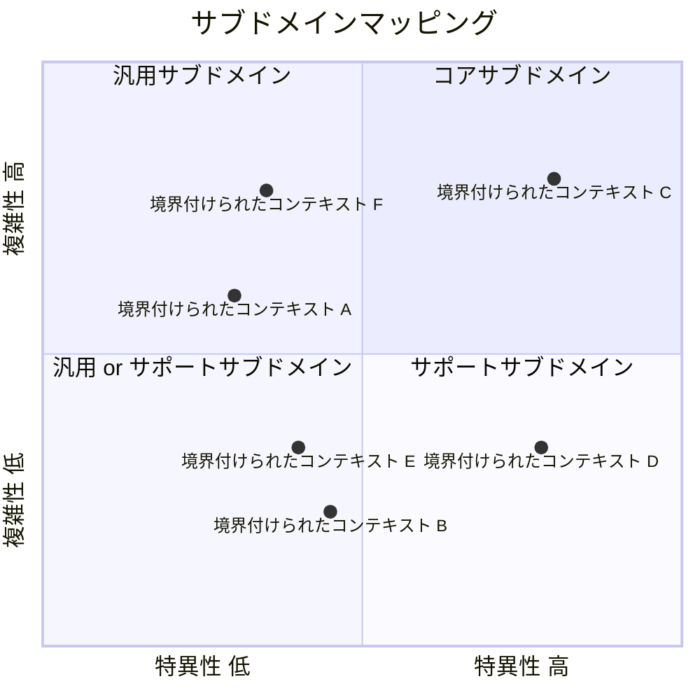

# 1. sample adr

日付: 2024-11-05

## ステータス

2024-11-05 提案されました

## 文脈

### ビジネスモデル

```mermaid
mindmap
  root((ビジネスモデル))
    外部環境
      競争
      政治・社会・技術
      マクロ経済
      市場
    内部環境
      顧客
        顧客セグメント
        顧客関係
      価値
        価値提案
        チャネル
      インフラ
        主要活動
        主要パートナー
      資金
        収益源
          売上
        コスト構造
          変動費
          固定費
```

### インパクトマップ

```mermaid
mindmap
  root((Goals))
    Actors
      Impacts
        Deliverables
        Deliverables
      Impacts
        Deliverables
      Impacts
        Deliverables
        Deliverables
    Actors
      Impacts
        Deliverables
      Impacts
        Deliverables
    Actors
      Impacts
        Deliverables
      Impacts
        Deliverables
```

### ドメイン

```mermaid
mindmap
  root((ドメイン))
    組織
      ドメイン
        企業ドメイン
          理念
          ビジョン
          ミッション
        事業ドメイン
          誰に
          何を
          どのように
        サブドメイン
          コアサブドメイン
          汎用サブドメイン
          サポートサブドメイン
    事業
      部門
      部門
      部門
```

```mermaid
quadrantChart
    title サブドメインマッピング
    x-axis "特異性 低" --> "特異性 高"
    y-axis "複雑性 低" --> "複雑性 高"
    quadrant-1 "コアサブドメイン"
    quadrant-2 "汎用サブドメイン"
    quadrant-3 "汎用 or サポートサブドメイン"
    quadrant-4 "サポートサブドメイン"
    "境界付けられたコンテキスト A": [0.3, 0.6]
    "境界付けられたコンテキスト B": [0.45, 0.23]
    "境界付けられたコンテキスト C": [0.80, 0.80]
    "境界付けられたコンテキスト D": [0.78, 0.34]
    "境界付けられたコンテキスト E": [0.40, 0.34]
    "境界付けられたコンテキスト F": [0.35, 0.78]
```

## 決定

ここに決定事項を記載...

## 結果

ここに結果を記載...
